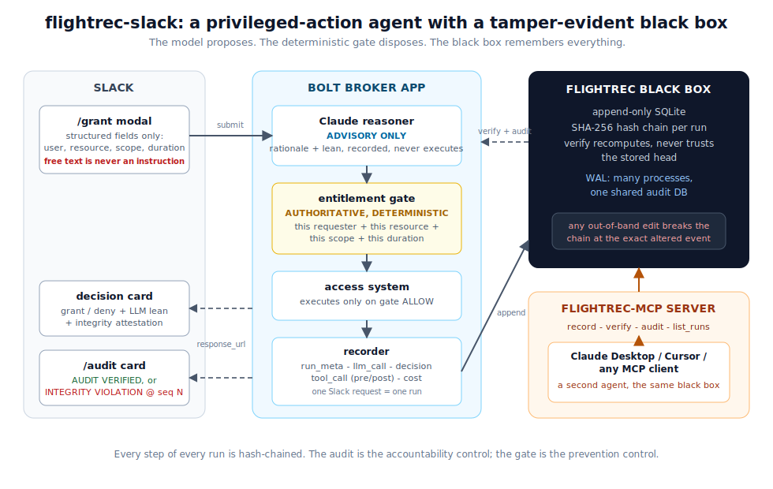
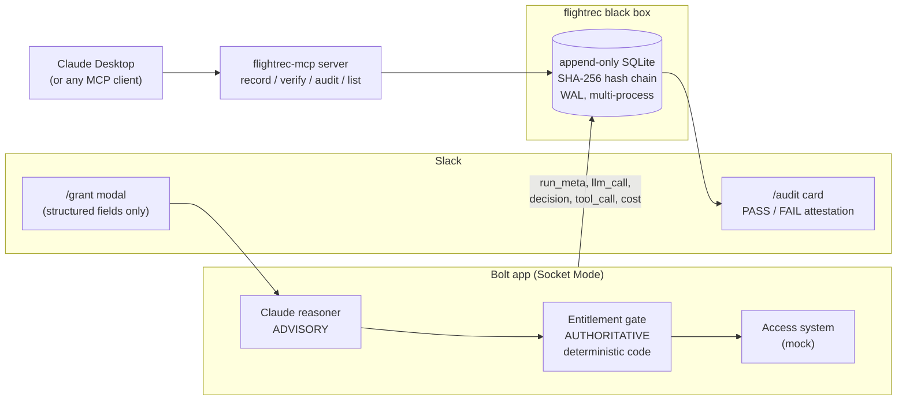

# flightrec-slack

**A privileged-action Slack agent whose every decision is recorded in a tamper-evident black box.**

Built for the Slack Agent Builder Challenge (New Slack Agent track). The agent grants
and denies access requests in Slack; [flightrec](https://github.com/kitfunso/flightrec)
records every step of every run into an append-only, hash-chained audit store. If anyone
edits the record afterward, even with raw database access, the next audit flips to
**INTEGRITY VIOLATION** at the exact altered step.

## What it does

- **`/grant`** opens a structured form: who gets access, to which resource, at what
  scope, for how long. Claude reasons about the request (advisory). A deterministic
  entitlement gate decides (authoritative). The action executes against an access
  system, and a decision card posts to the channel with an integrity attestation.
- **`/audit`** renders the tamper-evident audit report for the latest run (or
  `/audit <runId>` for a specific one): the request, the model's rationale, the
  decision, the tool calls, the token spend, each event hash-linked to the last.
- **`/audit tamper`** (demo mode only) simulates an insider with raw database access
  rewriting a recorded event. The audit card flips from 🔒 AUDIT VERIFIED to
  🚨 INTEGRITY VIOLATION, pointing at the broken sequence number.
- **flightrec-mcp** (the `mcp/` subpackage) exposes the same black box as an MCP
  server, so any MCP client (Claude Desktop, Cursor, a CI agent) records into the
  same audit store the Slack bot uses. Two agents, one black box.

## Why

Regulated organizations cannot deploy AI agents that take real actions, because they
cannot prove afterward what the agent did. A log file you can edit is not evidence.
flightrec-slack pairs the agent with a black box: append-only SQLite, SHA-256 hash
chain per run, integrity verification that never trusts a stored head hash. The audit
is the accountability control; prevention lives in the policy gate.

## The security model: the model proposes, the gate disposes

The scariest failure for a privileged-action agent is prompt injection. Two design
decisions close it:

1. **Command channel and data channel are separate.** Actions are triggered only by
   the structured modal (typed fields). Free-text messages are never instructions.
   There is no code path from thread text to an action.
2. **The gate is parameter-level and deterministic.** It asks "is THIS requester
   entitled to grant THIS scope on THIS resource for THIS duration" against
   `entitlements.json`, in plain code (`src/gate.ts`). Field values are inert data:
   an injection string in a field can only fail to match an entitlement, never
   grant authority. The LLM's opinion is recorded in the audit but executes nothing.

The test suite proves the ordering: a stub reasoner that always proposes "grant"
still gets denied by the gate on every over-reach.

## Architecture





One Slack request = one flightrec run. Every run records `run_meta` (who asked for
what), `llm_call` (the model's rationale and lean), `decision` (gate verdict),
`tool_call` (pre/post pair for the executed action; denials record no tool call, so
the inventory shows only what ran), and `cost` (token spend), then closes.

## Quickstart

Requires Node >= 22.13 (uses built-in `node:sqlite`). flightrec is consumed as a
sibling path dependency, so clone both repos side by side:

```bash
git clone https://github.com/kitfunso/flightrec.git
git clone https://github.com/kitfunso/flightrec-slack.git
cd flightrec-slack
npm install
```

### Slack app setup

1. At [api.slack.com/apps](https://api.slack.com/apps) create a new app **from an
   app manifest**, pasting `slack-app-manifest.json`. This configures the
   `/grant` and `/audit` commands, interactivity, and Socket Mode in one step.
2. Create an app-level token with the `connections:write` scope
   (Basic Information → App-Level Tokens) → `SLACK_APP_TOKEN` (starts `xapp-`).
3. Install the app to your workspace → Bot User OAuth Token → `SLACK_BOT_TOKEN`
   (starts `xoxb-`).
4. `cp .env.example .env` and fill in the tokens. `ANTHROPIC_API_KEY` is optional:
   without it the app uses a stub reasoner and the gate still enforces policy.
5. `cp entitlements.example.json entitlements.json` and add your Slack member ID as
   a grantor. Entitlements load at startup, so restart after editing. The example
   file includes a `"*"` any-member policy entry on the `demo-sandbox` resource
   (read, max 1h) so newly joined members can experience a grant without manual
   provisioning; the gate still checks resource, scope, and duration. Delete that
   entry for anything beyond a demo.

### Run

```bash
npm start                                          # build + run
FLIGHTREC_DEMO=1 node --env-file=.env dist/app.js  # with the tamper demo enabled
```

In Slack: `/grant` → fill the form → decision card → **View audit** → `/audit tamper`
to watch the attestation flip.

### Tests

26 tests, all against a real SQLite database (no store mocks):

```bash
npm test           # 20: gate, broker, recorder contract, tamper detection
cd mcp && npm test # 6: MCP tool handlers + a stdio round-trip integration test
```

## The MCP server

`mcp/` is a standalone MCP server over the same audit store, with four tools:
`flightrec_record`, `flightrec_verify`, `flightrec_audit`, `flightrec_list_runs`.
All writes go through flightrec's `appendEvent` (redaction + hash boundary), so a
hostile client can append junk but can never forge a clean chain or alter history.

Point Claude Desktop at it (`claude_desktop_config.json`), using absolute paths and
the same `FLIGHTREC_DB` the Slack app writes to:

```json
{
  "mcpServers": {
    "flightrec": {
      "command": "node",
      "args": ["<absolute path>/flightrec-slack/mcp/dist/server.js"],
      "env": { "FLIGHTREC_DB": "<absolute path>/flightrec-slack/data/audit.db" }
    }
  }
}
```

flightrec opens the database in WAL mode with a busy timeout, so the Slack app and
MCP clients safely share one file. Record a run from Claude Desktop, then `/audit`
it in Slack.

## Known limitations (deliberate for the hackathon build)

- The access system is an in-repo mock. The broker's interfaces are real; the
  integration target is not.
- The gate binds to requester entitlements (resource, scope, duration) but has no
  target-user dimension: an entitled requester can grant to any user, including
  themselves. A production gate would add target constraints and approval flows.
- Socket Mode transport. Right for a sandboxed demo; a Marketplace distribution
  would move to HTTP endpoints.
- Entitlements are a JSON file loaded at startup, not a live directory integration.

## License

MIT
